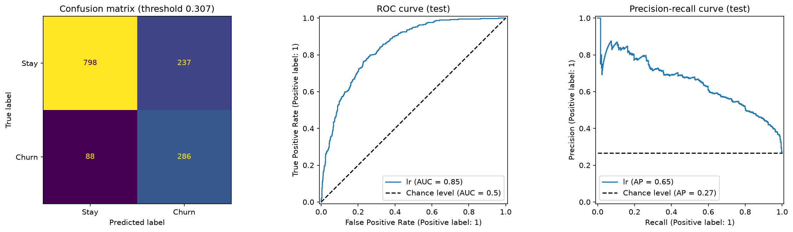

# Model comparison

Generated by `uv run python -m churn.modeling.train` on 2026-10-03.

## Cross-validation (train, 5x3 repeated stratified folds, tuned models)
Precision/recall/flagged share at each model's out-of-fold threshold
(best precision with recall >= 0.75).

| model | roc_auc | roc_auc_std | pr_auc | brier | threshold | precision | recall | flagged_share |
|---|---|---|---|---|---|---|---|---|
| lr | 0.8484 | 0.0145 | 0.6646 | 0.1339 | 0.3067 | 0.5508 | 0.7505 | 0.3616 |
| dt | 0.8292 | 0.0147 | 0.6254 | 0.1413 | 0.28 | 0.5124 | 0.7572 | 0.3921 |
| xgb | 0.8498 | 0.0137 | 0.6713 | 0.1334 | 0.3174 | 0.5565 | 0.7505 | 0.3578 |

Paired comparison on the same folds:
- roc_auc: xgb - lr = +0.0013 (~95% interval +0.0001 to +0.0026); xgb wins 11/15 folds
- pr_auc: xgb - lr = +0.0068 (~95% interval +0.0034 to +0.0102); xgb wins 14/15 folds

## Final model: LogisticRegression (elastic-net, unweighted)
Threshold 0.307. Selection rule: highest CV ROC-AUC, but a more complex
model must beat LR by >= 0.01 ROC-AUC or >= 0.02 precision at
recall >= 0.75 (see notebooks/5_tuning_final.ipynb, step 8).

## Test set (evaluated once)

| metric | cv_oof (train) | test |
|---|---|---|
| roc_auc | 0.848 | 0.8457 |
| pr_auc | 0.6622 | 0.6505 |
| precision | 0.5508 | 0.5468 |
| recall | 0.7505 | 0.7647 |
| f1 | 0.6353 | 0.6377 |
| f2 | 0.6998 | 0.7083 |
| accuracy | 0.7714 | 0.7693 |
| brier | 0.1339 | 0.1361 |
| flagged_share | 0.3616 | 0.3712 |

